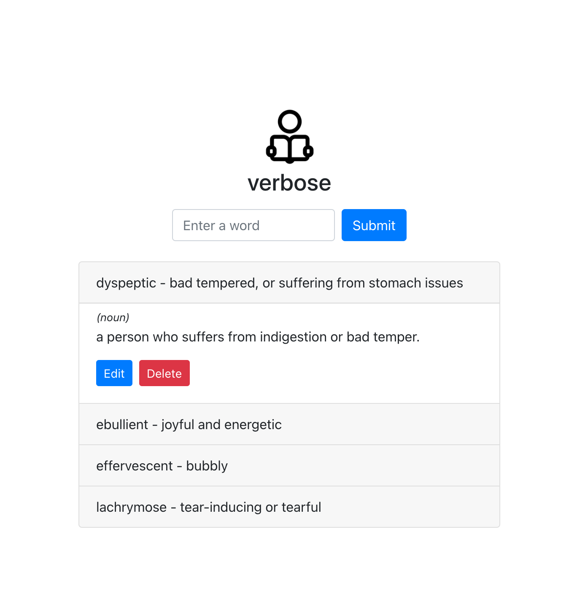

# verbose

Webapp designed to help you learn new vocabulary words quickly and effectively!
Made with React with Hooks and Context + Firebase + Owlbot API.

## 1. Install dependencies (optionally you can install [yarn](https://yarnpkg.com/)):

Navigate to the frontend folder in the cloned repo's directory.

Run:

`npm install`

or if you chose yarn, just run `yarn`

## 2. Add env varibles:

Create a .env file in the root directory and add: 

`REACT_APP_FIREBASE_DB=https://yourFirebaseAppName.firebaseio.com`

`REACT_APP_DB_URL=Your base API URL `

`REACT_APP_OWLBOT_API_KEY=Your API key from https://owlbot.info/`

## 3. Run the app:

To start the backend server, open the functions folder and run:

`firebase serve`

In another terminal window, navigate to the frontend folder and run:

`npm start`
